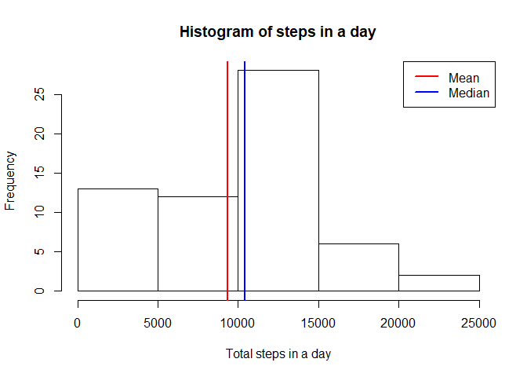
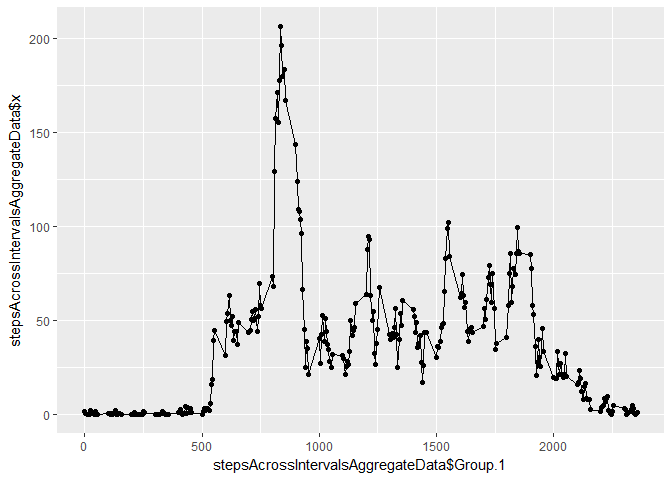
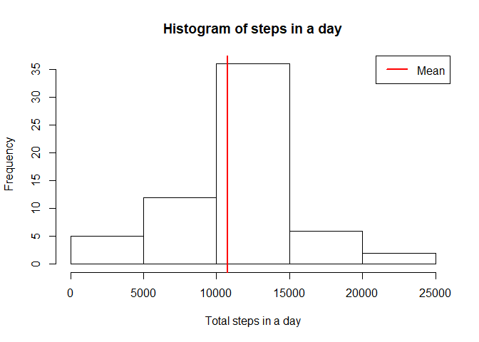
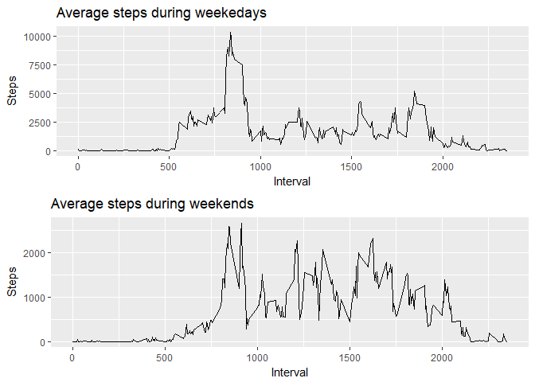

## Loading and preprocessing the data

```r
activitydata <- read.csv("activity.csv")
activitydata$date <- as.Date(activitydata$date)
```

## What is mean total number of steps taken per day?

```r
stepsAggregateData <- aggregate(activitydata[, "steps"], by=list(activitydata$date), FUN=sum, na.rm=T)
hist(stepsAggregateData$x, xlab = "Total steps in a day", ylab = "Frequency", main = "Histogram of steps in a day")
abline(v=median(stepsAggregateData$x, na.rm = T), col="blue", lwd=2)
abline(v=mean(stepsAggregateData$x, na.rm = T), col="red", lwd=2)
legend(x="topright", c("Mean", "Median"), col = c("red","blue"), lwd = c(2,2) )
```

<!-- -->


## What is the average daily activity pattern?

```r
library(ggplot2)
```

```
## Warning: package 'ggplot2' was built under R version 3.4.3
```

```r
stepsAcrossIntervalsAggregateData <- aggregate(activitydata[, "steps"], by=list(activitydata$interval), FUN=mean, na.rm=T)
qplot(stepsAcrossIntervalsAggregateData$Group.1, stepsAcrossIntervalsAggregateData$x) + geom_line()
```

<!-- -->


## Imputing missing values
Total missing values can be found using a summary on the steps

```r
summary(activitydata$steps)
```

```
##    Min. 1st Qu.  Median    Mean 3rd Qu.    Max.    NA's 
##    0.00    0.00    0.00   37.38   12.00  806.00    2304
```
We will use dplyr to summarize the data on each interval and use the mean for each interval to impute missing values

```r
library(dplyr)
```

```
## Warning: package 'dplyr' was built under R version 3.4.3
```

```
## 
## Attaching package: 'dplyr'
```

```
## The following objects are masked from 'package:stats':
## 
##     filter, lag
```

```
## The following objects are masked from 'package:base':
## 
##     intersect, setdiff, setequal, union
```

```r
intervalsummarydata <- activitydata %>% group_by(interval) %>% summarise_at(vars(steps), funs(mean(., na.rm=T)))
```

```
## Warning: package 'bindrcpp' was built under R version 3.4.4
```

```r
for (row in 1:nrow(activitydata)) {
  steps <- activitydata[row, "steps"]
  interval <- activitydata[row, "interval"]
  
  if(is.na(steps)) {
    steps <- intervalsummarydata$steps[intervalsummarydata$interval==interval]
    activitydata$steps[row] <- steps
  }
}
raggregate <- aggregate(activitydata[, "steps"], by=list(activitydata$date), FUN=sum, na.rm=T)
hist(raggregate$x, xlab = "Total steps in a day", ylab = "Frequency", main = "Histogram of steps in a day")
abline(v=mean(raggregate$x, na.rm = T), col="red", lwd=2)
legend(x="topright", c("Mean"), col = c("red","blue"), lwd = c(2,2) )
```

<!-- -->

The updated mean and median after imputing the missing values

```r
mean(raggregate$x)
```

```
## [1] 10766.19
```

```r
median(raggregate$x)
```

```
## [1] 10766.19
```


## Are there differences in activity patterns between weekdays and weekends?

Add a factor variable to the dataset to indicate weekday or weekend

```r
weekdays <- c('Monday', 'Tuesday', 'Wednesday', 'Thursday', 'Friday')
activitydata$wDay <- factor((weekdays(as.Date(activitydata$date)) %in% weekdays), levels=c(FALSE, TRUE), labels=c('weekend', 'weekday'))
```


```r
library(ggplot2)
source('multiplot.R')
```
Format the data set columns

```r
stepsAggregateDataw <- aggregate(activitydata[, "steps"], by=list(activitydata$wDay, activitydata$interval), FUN=sum, na.rm=T)
colnames(stepsAggregateDataw) <- c("wDay", "Interval", "Steps")
```

Set up the plot

```r
p1 <- ggplot(stepsAggregateDataw[stepsAggregateDataw$wDay %in% c("weekday"), ], aes(x=Interval, y=Steps)) + geom_line() + ggtitle("Average steps during weekedays")
p2 <- ggplot(stepsAggregateDataw[stepsAggregateDataw$wDay %in% c("weekend"), ], aes(x=Interval, y=Steps)) + geom_line() + ggtitle("Average steps during weekends")
multiplot(p1,p2, cols = 1)
```

<!-- -->

